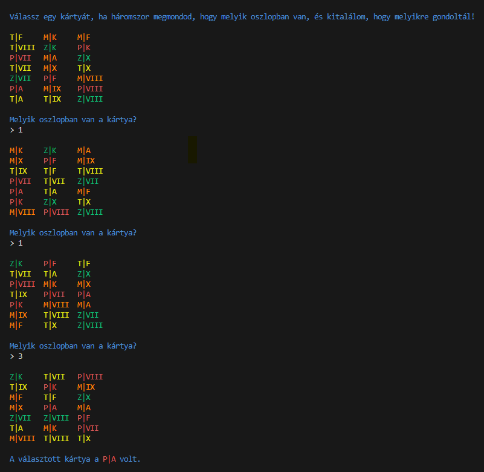

# Kártyatrükk

- Három oszlopba kiteszünk 21 kártyát.
- A játékos kiválaszt egy lapot.
- Háromszor újraosztják a lapokat, ami után minden alkalommal meg kell mondani, hogy melyik oszlopban van a választott lap.
- A harmadik újraosztás után a program megmondja, hogy melyik volt a választott lap!

